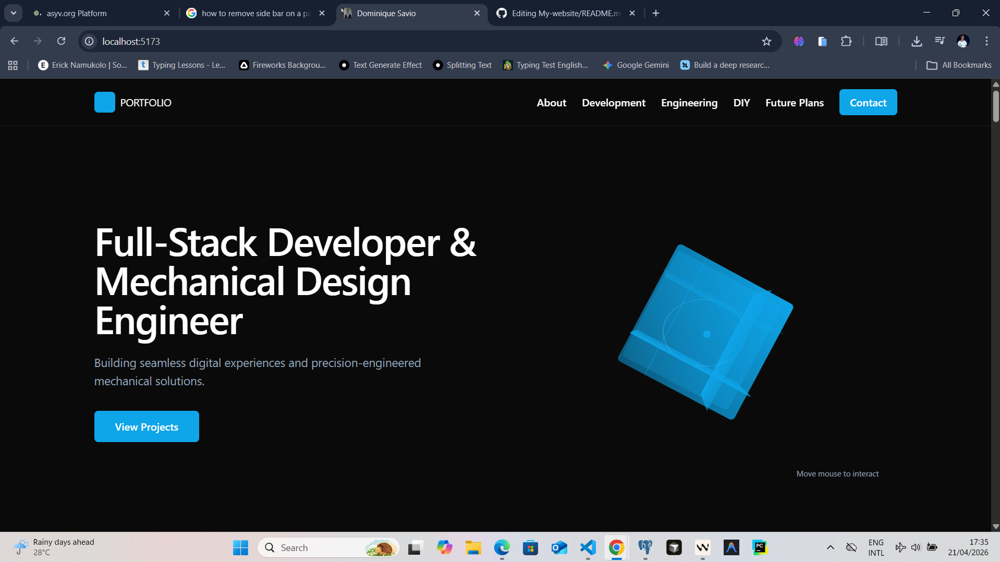

# Imanishimwe Dominique Savio | Full-Stack Developer & Mechanical Designer

A professional portfolio showcasing the intersection of digital craftsmanship and physical engineering. Built with a focus on performance, clean architecture, and modern aesthetics.

 

##  Overview

This website serves as my digital headquarters. It is designed to demonstrate my ability to build complex software systems while maintaining the precision and detail-oriented mindset of a mechanical engineer.

- **Live Demo:** [Link to your website (e.g., Vercel/Netlify)]
- **Case Studies:** Deep dives into software architecture and CAD projects.

##  Tech Stack

### Digital (Software Engineering)
- **Framework:** React 
- **Styling:** Tailwind CSS (Responsive)
- **3D Graphics:** React Three Fiber / Three.js

### Physical (Mechanical Design)
- **Tools:** SolidWorks / AutoCAD / Fusion 360
- **Expertise:** Precision Assemblies, Prototyping, and CAD-to-Code integration.

##  Key Features

- **Hybrid Portfolio:** A dual-view gallery showcasing both code repositories and mechanical assemblies.
- **Dynamic Projects:** Interactive 3D models rendered directly in the browser using Three.js.
- **Optimized Performance:** 100/100 Lighthouse scores for SEO and accessibility.
- **Professional Resume:** Integrated PDF viewer and downloadable CV.

##  Installation & Setup

If you'd like to run this project locally:

1. **Clone the repository:**
   ```bash
   git clone https://github.com/Dominic-Xavio1/My-website
